# CI/CD Setup — GitHub Actions → ECS via OIDC

How pushes to `main` get built, pushed to ECR, and rolled out to ECS Fargate,
with no static AWS access keys stored anywhere in GitHub.

## Contents

- [Architecture](#architecture)
- [Why OIDC instead of access keys](#why-oidc-instead-of-access-keys)
- [AWS-side components](#aws-side-components)
- [GitHub-side components](#github-side-components)
- [Repo files](#repo-files)
- [Deploy flow, step by step](#deploy-flow-step-by-step)
- [Known gotchas](#known-gotchas)
- [Runbook](#runbook)

---

## Architecture

```mermaid
flowchart TD
    Dev["Developer"] -->|"git push main"| GH["GitHub repo\nhimanshu6801/canvara"]

    subgraph Actions["GitHub Actions run"]
        Plan["plan job\ndiffs changed paths,\nbuilds service matrix"]
        Gate{{"production environment\nrequired reviewer + branch=main"}}
        Deploy["deploy job (matrix: backend / ai / frontend)"]
        Plan --> Gate --> Deploy
    end

    GH --> Plan

    Deploy -->|"1. OIDC token request"| OIDCProvider["AWS IAM OIDC provider\ntoken.actions.githubusercontent.com"]
    OIDCProvider -->|"2. sts:AssumeRoleWithWebIdentity\n(trust policy checks aud + sub)"| Role["IAM role\ncanvara-github-actions-deploy"]
    Role -->|"3. short-lived AWS credentials"| Deploy

    Deploy -->|"4. docker build + push\n(tag: git commit SHA)"| ECR["ECR repos\ncanvara-backend / canvara-ai / canvara-frontend"]
    Deploy -->|"5. register new task def revision\n(image swapped in .aws/*.json)"| TaskDef["ECS task definitions"]
    Deploy -->|"6. update-service"| ECS["ECS Fargate service\n(rolling deployment)"]

    ECS -->|"pulls new image"| ECR
    ECS -->|"health checks"| ALB["Application Load Balancer\n(target groups)"]
    ALB --> Users["End users"]

    style Gate fill:#3a2a00,stroke:#c98a00
```



**In words:** a push to `main` (or a manual trigger) starts a GitHub Actions run.
The `plan` job figures out which of the three services actually changed. The
`deploy` job then runs once per changed service, but only after a human
approves it via the `production` GitHub Environment gate. Each deploy: gets
temporary AWS credentials via OIDC (no stored keys), builds and pushes a
Docker image tagged with the exact commit SHA, registers a new ECS task
definition revision pointing at that image, and tells ECS to roll the service
over to it — ECS handles starting new tasks, health-checking them against the
load balancer, and draining the old ones.

---

## Why OIDC instead of access keys

The traditional approach — an `AWS_ACCESS_KEY_ID`/`AWS_SECRET_ACCESS_KEY`
pair stored as GitHub Secrets — is a long-lived credential sitting in GitHub's
infrastructure indefinitely. If it ever leaks (a misconfigured log line, a
compromised Action dependency, a secret accidentally echoed in a debug step),
it's valid until someone notices and manually rotates it. That risk is higher
on a **public repository**, where the workflow file itself, and any Action it
depends on, is visible to anyone.

OIDC removes the stored credential entirely. GitHub mints a fresh, signed
identity token for each workflow run, valid for only that run. AWS verifies
the token's signature against GitHub's public keys and exchanges it for AWS
credentials that expire in about an hour — there is never a secret sitting at
rest to leak.

---

## AWS-side components

### 1. OIDC Identity Provider

An AWS IAM object that registers GitHub as a trusted external identity
issuer, one per AWS account:

- **URL:** `https://token.actions.githubusercontent.com`
- **Audience:** `sts.amazonaws.com`

**Why it's needed:** without this, AWS has no way to verify or trust tokens
signed by GitHub at all — this is what makes `sts:AssumeRoleWithWebIdentity`
even possible for a GitHub-issued token. It's shared infrastructure: every
role in the account that wants to trust *any* GitHub Actions workflow points
at this same provider; it says nothing on its own about *which* repo is
allowed in — that's the trust policy's job, below.

### 2. IAM role — `canvara-github-actions-deploy`

The role GitHub Actions assumes for the duration of a deploy job. Two parts:

**Trust policy** (who can assume it):
```json
{
  "Version": "2012-10-17",
  "Statement": [
    {
      "Effect": "Allow",
      "Principal": {
        "Federated": "arn:aws:iam::318731644726:oidc-provider/token.actions.githubusercontent.com"
      },
      "Action": "sts:AssumeRoleWithWebIdentity",
      "Condition": {
        "StringEquals": {
          "token.actions.githubusercontent.com:aud": "sts.amazonaws.com",
          "token.actions.githubusercontent.com:sub": "repo:himanshu6801/canvara:environment:production"
        }
      }
    }
  ]
}
```

**Why each clause exists:**

- `Principal.Federated` — restricts assumption to tokens issued by the
  GitHub OIDC provider specifically, not any other identity in the account.
- `aud` condition — confirms the token was minted for AWS STS, not some
  other third-party audience GitHub might issue tokens for.
- `sub` condition — **the actual repo-scoping**, and the most important
  line in this whole setup. The `Federated` principal alone identifies "a
  token from GitHub," not "a token from *this* repo" — `token.actions.
  githubusercontent.com` is the same shared provider used by every GitHub
  Actions workflow on every public repo on GitHub.com. Without this
  condition, *any* repository's workflow could assume this role. Matching
  it with `StringEquals` (exact match) against
  `repo:himanshu6801/canvara:environment:production` — rather than
  `StringLike` with a wildcard against just the repo, which is the AWS
  console wizard's default — narrows it down to only runs of jobs that
  target this repo's `production` GitHub Environment specifically, not
  merely any branch/tag in the repo.

**Permissions policy** (`canvara-deploy`, inline on the role — what it can
do once assumed):
```json
{
  "Version": "2012-10-17",
  "Statement": [
    {
      "Sid": "ECRAuth",
      "Effect": "Allow",
      "Action": "ecr:GetAuthorizationToken",
      "Resource": "*"
    },
    {
      "Sid": "ECRPushPull",
      "Effect": "Allow",
      "Action": [
        "ecr:BatchCheckLayerAvailability", "ecr:GetDownloadUrlForLayer",
        "ecr:BatchGetImage", "ecr:InitiateLayerUpload",
        "ecr:UploadLayerPart", "ecr:CompleteLayerUpload", "ecr:PutImage"
      ],
      "Resource": [
        "arn:aws:ecr:us-east-1:318731644726:repository/canvara-backend",
        "arn:aws:ecr:us-east-1:318731644726:repository/canvara-ai",
        "arn:aws:ecr:us-east-1:318731644726:repository/canvara-frontend"
      ]
    },
    {
      "Sid": "ECSTaskDefinitionReadWrite",
      "Effect": "Allow",
      "Action": ["ecs:RegisterTaskDefinition", "ecs:DescribeTaskDefinition"],
      "Resource": "*"
    },
    {
      "Sid": "ECSDeploy",
      "Effect": "Allow",
      "Action": [
        "ecs:UpdateService", "ecs:DescribeServices",
        "ecs:DescribeTasks", "ecs:ListTasks"
      ],
      "Resource": [
        "arn:aws:ecs:us-east-1:318731644726:cluster/canvara-cluster",
        "arn:aws:ecs:us-east-1:318731644726:service/canvara-cluster/canvara-backend-service",
        "arn:aws:ecs:us-east-1:318731644726:service/canvara-cluster/canvara-ai",
        "arn:aws:ecs:us-east-1:318731644726:service/canvara-cluster/canvara-frontend",
        "arn:aws:ecs:us-east-1:318731644726:task/canvara-cluster/*"
      ]
    },
    {
      "Sid": "PassRoleToECSTasksOnly",
      "Effect": "Allow",
      "Action": "iam:PassRole",
      "Resource": [
        "arn:aws:iam::318731644726:role/canvara-task-execution-role",
        "arn:aws:iam::318731644726:role/canvara-backend-task-role"
      ],
      "Condition": {
        "StringEquals": { "iam:PassedToService": "ecs-tasks.amazonaws.com" }
      }
    }
  ]
}
```

**Why each statement exists:**

- **`ECRAuth`** — `ecr:GetAuthorizationToken` needs `Resource: "*"`; ECR's
  API doesn't support scoping this specific call to individual
  repositories. It only returns a login token — the actual push/pull
  access is enforced by the next statement.
- **`ECRPushPull`** — scoped to exactly the 3 repos this pipeline owns.
  Without this list (i.e. if it were also `"*"`), the role could push
  images to *any* ECR repo in the account.
- **`ECSTaskDefinitionReadWrite`** — also forced to `"*"` by an ECS API
  limitation (these two actions don't support resource-level restriction).
  This looks broad in isolation, but registering a task definition by
  itself does nothing — it's an inert JSON document until a service is
  told to use it, which is gated by the next statement.
- **`ECSDeploy`** — this is what actually closes the gap left above.
  `ecs:UpdateService` (the only action that makes a task definition revision
  live) is locked to the cluster and the 3 named services only. So even in
  a worst case, this role's practical ceiling is "can roll a new image onto
  one of these 3 services" — not "can do anything to any ECS resource in
  the account."
- **`PassRoleToECSTasksOnly`** — the most security-critical statement here.
  `iam:PassRole` is what lets ECS launch a task under a given role on this
  role's behalf. Left unscoped, combined with `RegisterTaskDefinition`
  being forced to `"*"` above, a compromised workflow could register a
  task definition that passes in *any* role in the account — a classic
  privilege-escalation path. Scoping it to exactly the two roles ECS tasks
  actually use, plus the `iam:PassedToService: ecs-tasks.amazonaws.com`
  condition (so those roles can only be handed to the ECS tasks service,
  not e.g. Lambda or an EC2 instance profile), closes that off.

---

## GitHub-side components

### Environment: `production`

Configured under repo **Settings → Environments**:
- **Required reviewers** — a human must click Approve before the `deploy`
  job runs, every time.
- **Deployment branches restricted to `main`** — closes a gap the trust
  policy's `sub` condition alone doesn't cover (a workflow could otherwise
  target the `production` environment from a non-`main` branch and still
  satisfy the OIDC `sub` claim).

**Why it's needed:** this is the human approval gate, and it's what the
trust policy's `environment:production` condition is actually anchored to —
without a GitHub Environment configured with that exact name, GitHub simply
never includes an `environment` claim in the OIDC token, and every
`AssumeRoleWithWebIdentity` call fails the trust policy's `sub` check.

### Repository variables (not secrets)

| Name | Value | Purpose |
|---|---|---|
| `AWS_DEPLOY_ROLE_ARN` | `arn:aws:iam::318731644726:role/canvara-github-actions-deploy` | Which role `configure-aws-credentials` assumes |
| `VITE_API_BASE_URL` | `http://canvara-alb-1741736266.us-east-1.elb.amazonaws.com:8080` | Baked into the frontend's static build at `docker build` time (the frontend calls the backend on a different port, so this must be an absolute URL — see [Known gotchas](#known-gotchas)) |

Stored as **Variables**, not **Secrets**, because neither value is
sensitive — a role ARN and a public URL are not credentials.

---

## Repo files

| Path | Purpose |
|---|---|
| `.github/workflows/deploy.yml` | The pipeline itself. Must live at exactly this path — GitHub Actions only discovers workflows under `.github/workflows/`. |
| `.github/deploy-services.json` | Per-service metadata table (paths, ECR repo, container name, ECS cluster/service, task def file) that the workflow reads to build its matrix and to detect which service(s) changed in a given push, instead of hardcoding 3 near-identical copies of every step in the YAML. |
| `.aws/backend-task-definition.json`, `.aws/ai-task-definition.json`, `.aws/frontend-task-definition.json` | The base ECS task definition for each service — CPU/memory, IAM roles, Secrets Manager references, log config, port mappings — everything except the image tag, which the workflow patches per run. **Exported from the live, already-registered task definitions** (`aws ecs describe-task-definition`) rather than hand-written, so they're guaranteed to match what's actually deployed rather than a guess. Safe to commit: they contain Secrets Manager **ARNs** (pointers), never secret values. |

---

## Deploy flow, step by step

1. Push lands on `main` (or someone clicks **Run workflow** for a manual
   `workflow_dispatch`, which always targets all 3 services).
2. `plan` job diffs the commit against each service's `path` in
   `deploy-services.json`, builds a JSON matrix of only what changed.
3. `deploy` job starts one parallel run per changed service, **pauses at
   the `production` environment gate** until a reviewer approves.
4. Per service: `configure-aws-credentials` exchanges the run's OIDC token
   for temporary AWS credentials by assuming `canvara-github-actions-deploy`.
5. `amazon-ecr-login` authenticates Docker to ECR using those credentials.
6. `docker build` (natively on an **ARM64** GitHub-hosted runner —
   see [Known gotchas](#known-gotchas)) then `docker push`, tagged with the
   full commit SHA (`github.sha`) — never `:latest`, so every image is
   traceable to an exact commit and previous images are never overwritten,
   which also means every past deploy is an instant rollback target.
7. `amazon-ecs-render-task-definition` takes the committed `.aws/*.json`
   and produces a copy with just the `image` field swapped to the new
   ECR URI:SHA.
8. `amazon-ecs-deploy-task-definition` registers that as a new task
   definition revision and calls `ecs:UpdateService`, then
   (`wait-for-service-stability: true`) blocks until ECS confirms the new
   tasks are healthy on the load balancer and old tasks have drained — the
   job fails loudly if that doesn't happen within 10 minutes, rather than
   silently reporting success on a broken deploy.

---

## Known gotchas

Things that weren't obvious going in and cost real debugging time —
recorded here so they don't get re-discovered from scratch:

- **ECS task definitions require ARM64** (`runtimePlatform.cpuArchitecture:
  ARM64` in all three `.aws/*.json` files). GitHub's default `ubuntu-latest`
  runner is x86_64; a plain `docker build` there produces an amd64 image,
  which fails at container start with `exec format error`. Fixed by running
  the `deploy` job on `runs-on: ubuntu-24.04-arm` (a native ARM64
  GitHub-hosted runner) instead of cross-compiling via QEMU, which would
  also work but is significantly slower for the backend's Maven build.
- **ECS service names don't follow one consistent convention** —
  `canvara-backend-service`, but `canvara-ai` and `canvara-frontend` (no
  `-service` suffix). Confirmed via `aws ecs list-services`, not guessable
  from the task definition family names (`canvara-backend`, `canvara-ai`,
  `canvara-frontend`), which *do* follow a clean pattern. Recorded exactly
  in `deploy-services.json`'s `ecs_service` field per service.
- **`iam:PassRole` scope depends on which services actually have a task
  role.** Only `canvara-backend` has one (`canvara-backend-task-role`, for
  S3 upload access) — `canvara-ai` and `canvara-frontend` have
  `taskRoleArn: null` and rely on the execution role only. Confirmed via
  `aws ecs describe-task-definition ... --query taskDefinition.taskRoleArn`
  before finalizing the permissions policy, rather than assumed.
- **The frontend calls the backend cross-origin, not same-origin.**
  `VITE_API_BASE_URL` points at the ALB's DNS name on port `:8080`
  directly, while the frontend itself is served on a different port —
  same host, different port still counts as a different origin under
  browser same-origin rules. The backend must have CORS configured to
  allow that origin, or every API call from the deployed frontend breaks
  regardless of anything in this pipeline.
- **Open issue, not fixed by this pipeline:** the `canvara-ai` ECS service
  is currently registered against `canvara-frontend-tg` (the frontend's
  ALB target group) instead of the correct `canvara-ai-tg`. This is a
  pre-existing infra misconfiguration, not something the CI/CD setup
  introduced — but it means every rolling deployment of `canvara-ai` will
  fail its health checks and never complete, because it's being checked
  against the frontend's health check rule (`GET /` on port 80) instead of
  its own (`GET /health` on port 8000). `ecs:UpdateService` cannot change a
  service's target group association — fixing this requires deleting and
  recreating the `canvara-ai` service pointed at `canvara-ai-tg`. **Needs
  to be done before `canvara-ai` deploys will succeed.**

---

## Runbook

**Add a new service to the pipeline:** add a row to
`.github/deploy-services.json` with its path/Dockerfile/ECR
repo/container name/cluster+service/task def file, export its live task
definition into `.aws/`, add its ECR repo ARN to the `ECRPushPull`
statement and its cluster/service ARNs to `ECSDeploy` in the
`canvara-deploy` IAM policy, and (if it has its own task role) add that
ARN to `PassRoleToECSTasksOnly`.

**A task definition changed by hand in the AWS console:** re-export it
(`aws ecs describe-task-definition --task-definition <family> --query
taskDefinition | jq 'del(.taskDefinitionArn,.revision,.status,
.requiresAttributes,.compatibilities,.registeredAt,.registeredBy,
.deregisteredAt)'`) and commit the diff — otherwise the next automated
deploy silently reverts to whatever's in git.

**Roll back a bad deploy:** find the previous task definition revision
(`aws ecs describe-services --cluster canvara-cluster --services
<service> --query 'services[0].taskDefinition'` shows the current one;
subtract 1, or check `aws ecs list-task-definitions --family-prefix
<family>` for the full history) and run
`aws ecs update-service --cluster canvara-cluster --service <service>
--task-definition <family>:<previous-revision>`. Every revision is tied
to one exact, still-pulls-fine image digest, since images are never
retagged.
